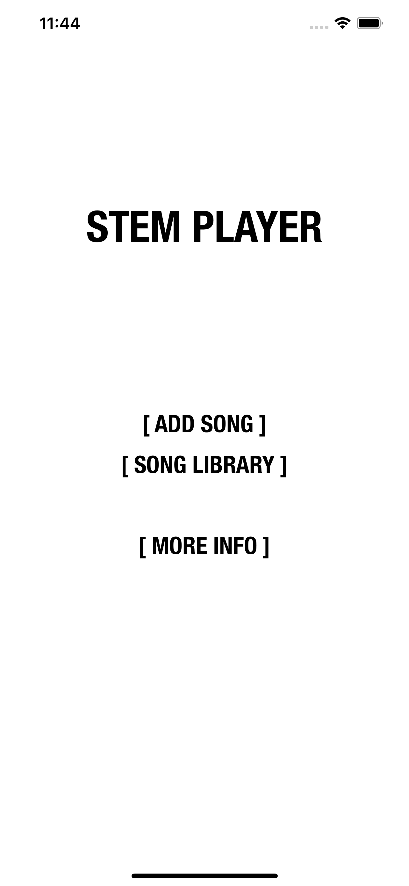

# Stem Player
Stem Player is an iOS app that can manipulate song stems.

## Demo
Start Screen|Add Song|Stem Player
:-------------------------:|:-------------------------:|:-------------------------:
||

## How it works
Stem Player is an iOS app that can manipulate song stems.

Stem Player allows you to upload and manipulate the stems of a song. It also includes the ability to save song configurations for later playerack. 

As of now, it does not support auto stem splitting, however I am working on making an API to do this. I also plan to add the other stem player features, like looping and effects.

## Installation
Stem Player can be installed from the [App Store](https://apps.apple.com/us/app/stem-player-remake-the-music/id1612768741).

## License
[MIT](https://choosealicense.com/licenses/mit/)

Copyright 2022 © Thatcher Clough.
